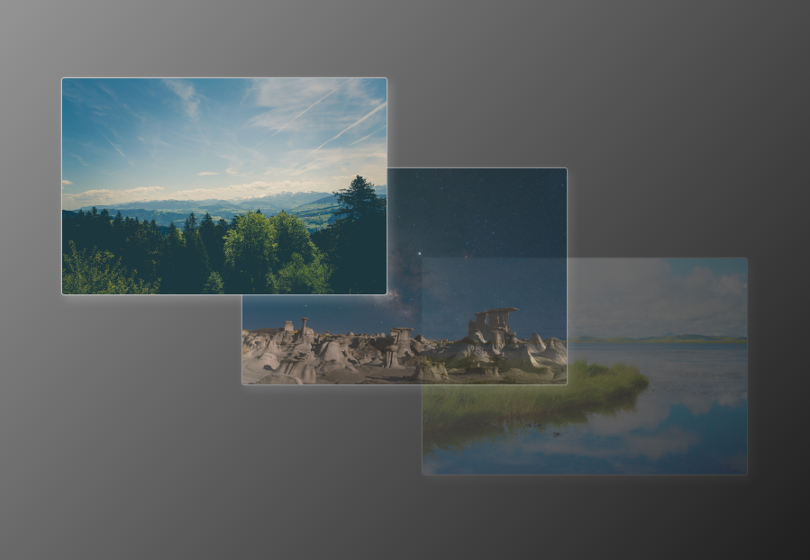

# Hover images

- [x] Arrange the images in a container using absolute positioning

- [x] On hover the image should appear on top of all the other images (without changing its position)

- [x] Each image has a white shadow

- [x] Images below are semi-transparent with the one at the bottom being the most transparent
